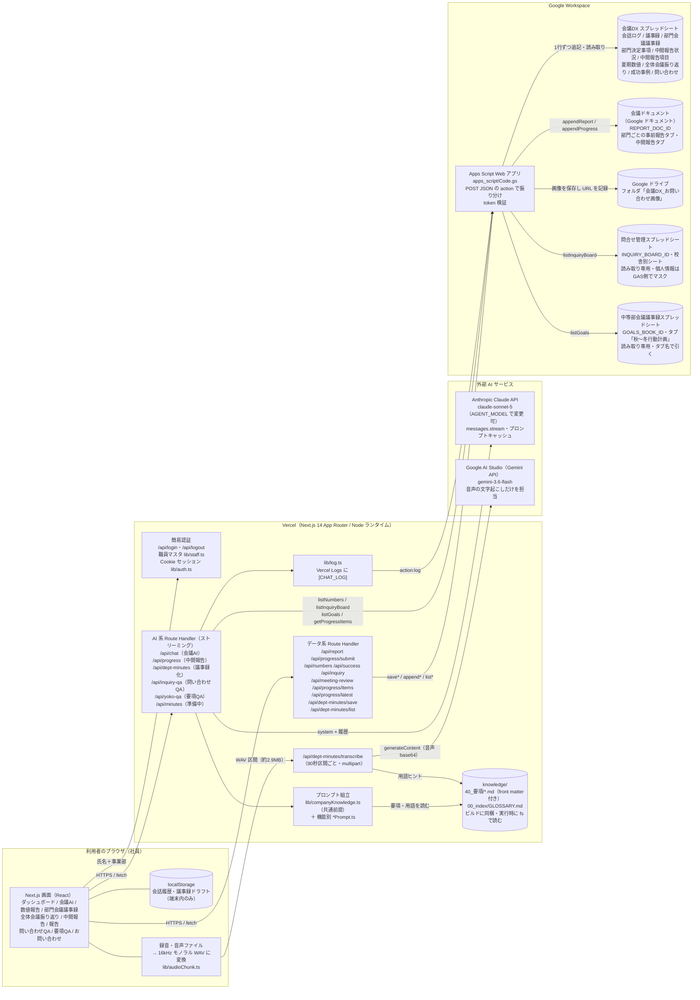
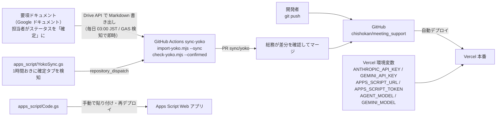
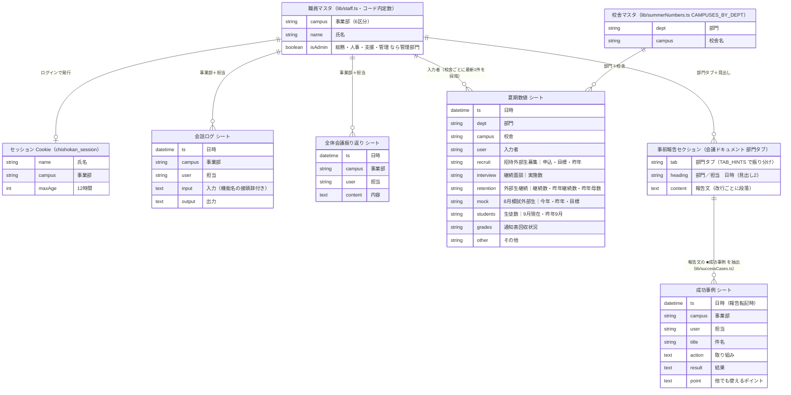
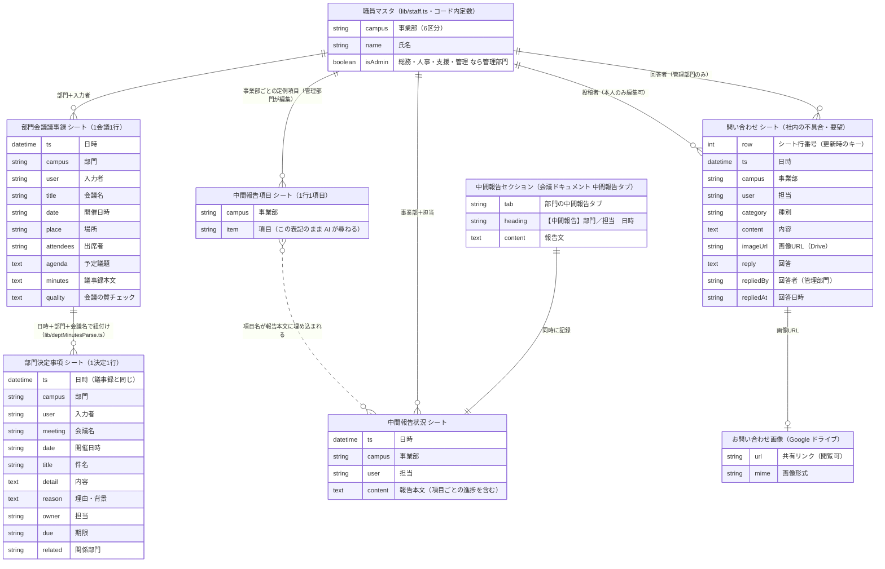
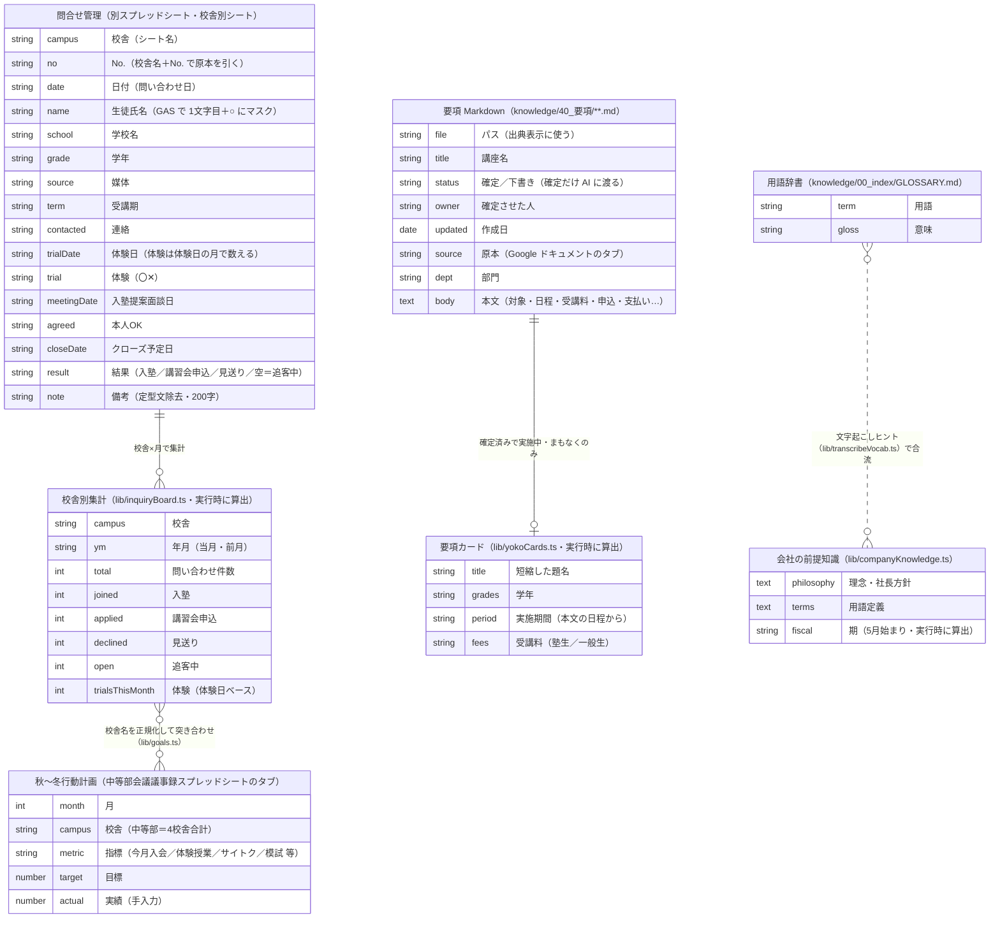

# 智翔館 会議DX ─ システム構成図・ER図（現状）

2026年9月時点のコードから起こした「いま動いている構成」の図。
設計案ではなく現状の写しなので、機能を足したり保存先を変えたりしたら、この図も直すこと。

- 図は Mermaid で書いてある。GitHub 上でそのまま描画される
- 対応するコードの場所を各所に添えた。図と食い違ったらコードが正

---

## 1. システム構成図

### 1-1. 全体像

要点:

| 層 | 役割 | 補足 |
|---|---|---|
| ブラウザ | 画面表示・録音・WAV 変換・会話履歴の一時保持 | 会話履歴とドラフトは localStorage。端末を変えると引き継がれない |
| Vercel（Next.js） | 認証、プロンプト組立、AI 呼び出し、Google への転記依頼 | API キーはすべてサーバ環境変数。ブラウザには渡らない |
| Claude API | 対話・議事録化・QA 回答 | 全機能で共通の会社前提（lib/companyKnowledge.ts）を先頭に置く |
| Gemini API | 音声の文字起こしのみ | Claude が音声を読めないため。未設定でも貼り付け運用で動く |
| Apps Script | Google 側の唯一の入口 | Next からは常に `APPS_SCRIPT_URL` へ POST。GAS が各シート・ドキュメントへ振り分ける |
| Google Sheets / Docs / Drive | 永続データ | RDB は無い。スプレッドシートの各シートが「テーブル」に相当する |
| knowledge/（git） | 確定済み要項・用語辞書 | Google ドキュメントを直接読まず、担当者が確認したものだけを git に置く |

### 1-2. 機能ごとの経路

```mermaid
flowchart TB
  subgraph f1["会議AI（事前報告・夏の結果報告）→ 報告"]
    direction LR
    a1["/chat 画面"] -->|"messages"| a2["/api/chat"]
    a2 -->|"summer モードは listNumbers で夏期数値を差し込む"| a3["Claude"]
    a3 -->|"報告文"| a1
    a1 -->|"貼り付け"| a4["/report 画面"]
    a4 --> a5["/api/report"]
    a5 -->|"appendReport"| a6["会議ドキュメント 部門タブ"]
    a5 -->|"■ 成功事例 を抽出 → saveSuccess"| a7["成功事例シート"]
  end

  subgraph f2["部門会議議事録"]
    direction LR
    b1["/dept-minutes 画面<br/>会議情報入力・録音"] -->|"WAV 90秒ごと"| b2["/api/dept-minutes/transcribe"]
    b2 --> b3["Gemini"]
    b3 -->|"文字起こし"| b1
    b1 -->|"transcript + meta"| b4["/api/dept-minutes"]
    b4 --> b5["Claude（テンプレート準拠）"]
    b5 -->|"議事録ドラフト＋会議の質チェック"| b1
    b1 -->|"人が確認・修正して保存"| b6["/api/dept-minutes/save"]
    b6 -->|"決定事項を抽出<br/>saveDeptMinutes"| b7["部門会議議事録シート（1会議1行）<br/>部門決定事項シート（1決定1行）"]
  end

  subgraph f3["中間報告"]
    direction LR
    c1["/progress 画面"] --> c2["/api/progress"]
    c2 -->|"getProgressItems で部門の定例項目を取得"| c3["Claude"]
    c3 -->|"中間報告文"| c1
    c1 --> c4["/api/progress/submit"]
    c4 -->|"appendProgress"| c5["会議ドキュメント 中間報告タブ<br/>＋ 中間報告状況シート"]
    c6["/progress/settings（管理部門のみ）"] -->|"saveProgressItems"| c7["中間報告項目シート"]
  end

  subgraph f4["問い合わせQA（小中等部・管理部門のみ）"]
    direction LR
    d1["/inquiry-qa 画面"] --> d2["/api/inquiry-qa"]
    d2 -->|"listInquiryBoard（マスク済み）"| d3["問合せ管理スプレッドシート"]
    d2 -->|"listGoals"| d4["秋～冬行動計画タブ"]
    d2 -->|"集計値を『正』として渡す"| d5["Claude"]
  end

  subgraph f5["要項QA（全部門）"]
    direction LR
    e1["/yoko-qa 画面"] --> e2["/api/yoko-qa"]
    e2 -->|"status: 確定 のみ全文"| e3["knowledge/40_要項/*.md"]
    e2 --> e4["Claude"]
  end
```

### 1-3. 運用・デプロイの流れ

---

## 2. ER図

RDB は使っておらず、Google スプレッドシートの各シートが「テーブル」に相当する。
主キーや外部キーの制約は無く、**「日時＋事業部＋担当」の組が実質的なキー**になっている。
図中の関係線は「アプリのコードがどう突き合わせているか」を表す論理的なもの。

### 2-1. アプリが書き込むデータ（会議DX スプレッドシート・会議ドキュメント）

職員マスタを軸に2枚に分けた。どちらも同じスプレッドシートの中のシート。

#### 2-1a. 会議AI → 報告、数値報告、全体会議振り返り

#### 2-1b. 部門会議議事録、中間報告、お問い合わせ

### 2-2. 読み取り専用で参照する外部データ

アプリからは書き込まない。原本は各部門が普段どおり更新する。

### 2-3. データ一覧（保存先・書き手・読み手）

| データ | 保存先 | 書き込む経路 | 読む経路 | 備考 |
|---|---|---|---|---|
| 会話ログ | 会議DX シート「会話ログ」 | 各 AI Route → `lib/log.ts` → GAS `log` | （人が直接見る） | Vercel Logs にも `[CHAT_LOG]` で出力 |
| 事前報告 | 会議ドキュメント 部門タブ | `/api/report` → GAS `appendReport` | （会議で使う） | タブは部門名の部分一致で振り分け |
| 成功事例 | シート「成功事例」 | `/api/report` が報告文から抽出 → GAS `saveSuccess` | `/api/success` → ダッシュボード | 報告転記の付随処理。失敗しても報告は成功扱い |
| 夏期数値 | シート「夏期数値」 | `/api/numbers` POST → GAS `saveNumbers` | `/api/numbers` GET、`/api/chat`（summer） | 校舎ごとに最新1件を採用。見出しは `NUMBER_FIELDS` と連動 |
| 全体会議振り返り | シート「全体会議振り返り」 | `/api/meeting-review` → GAS `saveReview` | （人が直接見る） | |
| 部門会議議事録 | シート「部門会議議事録」 | `/api/dept-minutes/save` → GAS `saveDeptMinutes` | `/api/dept-minutes/list?scope=minutes` | 1会議1行。人が確認した最終テキストを保存 |
| 部門決定事項 | シート「部門決定事項」 | 同上（保存時に抽出） | `/api/dept-minutes/list` | 1決定1行。部門横断の見える化 |
| 中間報告 | 会議ドキュメント 中間報告タブ ＋ シート「中間報告状況」 | `/api/progress/submit` → GAS `appendProgress` | `/api/progress/latest` → ダッシュボード | 本文から項目と進捗だけを抜いて表示 |
| 中間報告項目 | シート「中間報告項目」 | `/api/progress/items` PUT（管理部門） → GAS `saveProgressItems` | `/api/progress`、`/api/progress/items` GET | 未登録の部門は `DEFAULT_PROGRESS_DEPT_ITEMS` を使う |
| お問い合わせ | シート「問い合わせ」＋ Drive 画像 | `/api/inquiry` POST/PATCH/PUT → GAS `saveInquiry` ほか | `/api/inquiry` GET | 行番号がキー。回答は管理部門のみ |
| 議事録スレッド（準備中） | シート「議事録」 | `/api/minutes/save` → GAS `saveMinutes` | ─ | 画面は「準備中」表示 |
| 問合せ管理 | 別スプレッドシート（`INQUIRY_BOARD_ID`） | ─（部門が原本を更新） | GAS `listInquiryBoard` → `/api/inquiry-qa` | 個人情報は GAS で落としてから返す |
| 目標（秋～冬行動計画） | 中等部会議議事録スプレッドシート（`GOALS_BOOK_ID`） | ─ | GAS `listGoals` → `/api/inquiry-qa` | タブは名前で引く |
| 要項 | `knowledge/40_要項/*.md` | `scripts/import-yoko.mjs` → git | `/api/yoko-qa` | `status: 確定` だけ AI に渡す |
| 用語辞書 | `knowledge/00_index/GLOSSARY.md` | git | `/api/dept-minutes/transcribe` | 文字起こしのヒントに使う |
| 職員マスタ | `lib/staff.ts` | git | `/api/login`、各 API の権限判定 | テスト運用のため合言葉は停止中 |

---

## 3. 権限と境界

| 区分 | 判定 | 影響範囲 |
|---|---|---|
| ログイン | 職員マスタに存在する「事業部＋氏名」の組 | 全画面（`app/(app)/layout.tsx` で未ログインは `/login` へ） |
| 管理部門（総務・人事・支援・管理） | `session.campus === ADMIN_CAMPUS` | 中間報告項目の編集、お問い合わせへの回答、問い合わせQA の閲覧 |
| 小中等部 | `ALLOWED_DEPTS` | 問い合わせQA の閲覧（画面と API の両方で制限） |
| 個人情報の境界 | Apps Script `listInquiryBoard_` | 氏名マスク・電話・住所・保護者名・メール除外。アプリにも Claude にも渡らない |
| API キーの境界 | Vercel 環境変数 | ブラウザには一切渡らない |

既知の要ハードニング（README「ログ / セキュリティ」参照）: セッションは署名なし Base64、認証は氏名＋事業部のみ。
知識ベースに機微情報を載せる前に Google SSO への移行が前提。

---

## 4. データ構成の方針（2026-09-16 決定）

目指す形は「アプリ → Google（ログ記録）」「Google → git（ナレッジ同期）」「アプリ → git（読み取り・検索）」の3本。
現状との差と、それぞれの扱いを決めた。

| 矢印 | 現状 | 決定 |
|---|---|---|
| ① アプリ → Google（ログ記録） | Apps Script 経由でシート・ドキュメントに記録している | **現状のままで OK** |
| ② Google → git（ナレッジ同期） | 要項だけ。書き出し→取り込み→確認→push をすべて人手で行う | **要項の「確定」を起点に自動化する**（下記 4-1） |
| ③ アプリ → git（読み取り・検索） | 要項と用語辞書だけを、ビルド同梱ファイルから全文読み | **保留**。基本機能の開発完了後、全体を組み直すタイミングで着手（下記 4-2） |

### 4-1. ② 要項の確定 → git 自動同期（実装済み・要セットアップ）

**起点**: 要項ドキュメント（Google ドキュメント）の各タブ ＜基本情報＞ の「ステータス」が「確定」になったこと。
確定していないタブは git に流さない（下書きの金額・期限が AI に渡る事故を防ぐ。現行ルールを維持）。

```mermaid
flowchart LR
  DOC["要項ドキュメント<br/>（Google ドキュメント・タブ＝1要項）"]
  GAS["Apps Script<br/>ステータス列を監視<br/>（編集トリガー or 夜間）"]
  ACT["GitHub Actions<br/>sync-yoko.yml"]
  EXP["Drive API で<br/>Markdown 書き出し"]
  IMP["scripts/import-yoko.mjs<br/>--sync（確定タブのみ上書き）"]
  CHK["scripts/check-yoko.mjs --confirmed<br/>必須項目チェック"]
  PR["Pull Request<br/>sync/yoko-YYYYMMDD"]
  REV["総務が差分を確認してマージ"]
  VC["Vercel 自動デプロイ<br/>→ 要項QA に反映"]

  DOC -->|"確定に変更"| GAS
  GAS -->|"repository_dispatch"| ACT
  ACT --> EXP --> IMP --> CHK --> PR --> REV -->|"main にマージ"| VC
```

実装: `.github/workflows/sync-yoko.yml`・`.github/workflows/check-yoko.yml`・`scripts/export-yoko-doc.mjs`・
`scripts/import-yoko.mjs --sync`・`apps_script/YokoSync.gs`。セットアップ手順は README「自動同期」の節。

**処理の中身**

1. **検知**: Apps Script が要項ドキュメントのタブを走査し、「ステータス：確定」のタブの一覧とハッシュを Script Properties に持つ。前回と差があれば GitHub の `repository_dispatch` を叩く。トリガーは編集時（onEdit 相当は Docs では使えないため時間主導で 1 時間おき）または夜間 1 回。
   ※ GAS を使わず GitHub Actions の夜間スケジュールだけでも成立する。GAS 側は「確定したらすぐ反映」を早めるための追加部品。
2. **書き出し**: GitHub Actions が Google サービスアカウントで Drive API `files.export`（`text/markdown`）を呼び、人が今「ファイル > ダウンロード > Markdown」でやっているものと同じ Markdown を得る。要項ドキュメントをサービスアカウントに閲覧共有しておく。
3. **取り込み**: `scripts/import-yoko.mjs` に `--sync` モードを足す。
   - ステータスが「確定」のタブだけを対象にする
   - **既存ファイルは front matter の `title` と講座名で突き合わせて上書きする**（ドキュメントが正本）。
     現行の「既存は上書きしない」は手動運用向けの安全策なので、`--sync` では逆にする
   - 突き合わせできない新規は `YYYY-MM_講座名.md` で作る。年月は作成日から取る
   - git 側が確定だったタブがドキュメント側で確定でなくなった場合は `status: 下書き` に戻す（AI が答えなくなる）
   - `_` 始まりのファイル・テンプレートタブは今までどおり触らない
4. **検査**: `check-yoko.mjs --confirmed` を CI として実行する。不足があれば PR に赤を付ける（ファイルは書くが、マージを止める）。
5. **PR**: 差分があるときだけ固定ブランチ `sync/yoko` で PR を作る（開いている PR があればそこに積む。PR が溜まらないようにするため）。総務がマージ。マージで Vercel が再デプロイし、要項QA に反映される。

**先に決めておくこと**

- **ファイル名の突き合わせ鍵**。今の 24 ファイルは取り込み後に人手で `2026-07_夏期_中等部.md` のように改名されており、タブ順の連番（`01_…`）とは一致しない。自動化では **front matter の `title` を鍵**にするので、ドキュメント側の講座名を変えると別ファイル扱いになる。講座名の変更は「旧ファイルを削除する PR」とセットで行う運用にする。
- **認証情報の置き場**。Google サービスアカウントの鍵は GitHub Secrets。GAS から dispatch する場合は GitHub の fine-grained トークン（Contents: write のみ）を Script Properties に置く。Vercel 側には何も足さない。
- **マージの自動化**。当面は人がマージする。check が緑なら自動マージにするかは運用が回ってから決める。
- **必須項目チェックの必須化**。2026-09 時点で確定済み 22 件すべてに「経理連絡事項」が無いため、チェックは当面「警告」に留めている。既存分を直したら必須化する（README 参照）。
- **旧形式のタブ**。＜基本情報＞が無いタブは同期の対象外（触らない）。自動同期に載せたい要項にはタブに ＜基本情報＞ を足す。

**この設計で変わらないこと**: `status: 確定` 以外は AI に渡さない、個人情報を git に入れない、Google ドキュメントを実行時に直接読まない。

### 4-2. ③ アプリ → git の読み取り・検索（保留）

現在の使い方（確定要項 24 件・約 5 万字を毎回プロンプトに載せる）は、プロンプトキャッシュが効いているため実運用上の問題は出ていない。
**基本機能の開発が終わり、全体を構築し直すタイミングで以下をまとめて扱う。それまで触らない。**

そのとき見直す項目:

- `knowledge/00_index/CLAUDE.md` と `INDEX.md` はどのコードからも読まれていない。CLAUDE.md を system prompt の先頭で読む形にする
- 理念・社長方針・用語定義が `lib/companyKnowledge.ts` にハードコードされている。`knowledge/10_理念・方針/` などの Markdown に移し、ナレッジ側で育てられるようにする
- 「全文をプロンプトに載せる」から「索引（INDEX.md）を渡して tool use でファイルを開く」方式へ切り替える。要項以外（部門マニュアル・規程）を載せ始めると全文方式は破綻する（`docs/knowledge-base-architecture.md` §5 の設計）
- 読み取り経路がビルド同梱＋`fs`（`next.config.mjs` の `outputFileTracingIncludes`）に依存している。同梱漏れで本番だけ 0 件になる構造を、索引方式への移行とあわせて解消する
- 機微情報をナレッジに載せる前提として Google SSO への移行（`docs/knowledge-base-architecture.md` §6）
